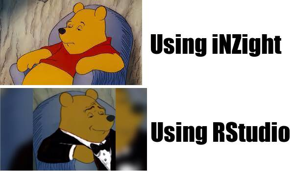

Edit the index.md file so that it [displays a new original meme] that you have created using R code and the {magick} package, as well as [the R code you used to create it.]
Your index.md file needs contain information about the meme you created, for example, what the motivation was, and how your meme is new/original 
  (e.g. an adaption of an existing meme format).

# My Meme

## *This is my meme*



## *How I made this meme*
I created this meme in `R`, using the [`magick package`](https://cran.r-project.org/web/packages/magick/vignettes/intro.html) using the following steps:
1. Read in the **images** (and re-scale where needed)
```r
# Square 1 - regular Winnie the Pooh
Winnie.Reg=image_read("https://encrypted-tbn0.gstatic.com/images?q=tbn:ANd9GcR2I24KGTXqQF0nKLyB-7O0JKKVBZkzPqp5r77rbW8xoflclrA0A_bmBNrswCtLsi5hOGY&usqp=CAU")
```

```r
# Square 2 - Tuxedo Winnie the Pooh
Winnie.Tux=image_read("https://i.kym-cdn.com/entries/icons/original/000/029/060/cover3.jpg")%>%
  image_scale(300)
```


2. Create the **word squares**
```r
# Square 3 - 1st comment
iNZ=image_blank(width=300,
                height=180,
                color = "#FFFFFF")%>%
  image_annotate(text="Using iNZight",
                 color="#000000",
                 size=50,
                 font="Impact",
                 gravity="center")

# Square 4 - 2nd comment
RSt=image_blank(width=300,
                height=180,
                color = "#FFFFFF")%>%
  image_annotate(text="Using RStudio",
                 color="#000000",
                 size=50,
                 font="Impact",
                 gravity="center")
```
3. **Combine** the four squares and **save**
```r
# Adding it all together

top=image_append(c(Winnie.Reg, iNZ))
bottom=image_append(c(Winnie.Tux,RSt))
meme=c(top, bottom)%>%
  image_append(stack=TRUE)

# Saving as `png` file
image_write(meme, "my_meme.png")
```
4. ***Ta-da!***


## *Why I made this meme*
- This is a popular meme format that I saw while taking a break in between lectures
- I sent the original meme to my boyfriend, who laughed, inspiring me to make my own
- The switch from `STATS101` to other `STATS` courses was a big step up, and the change in programs we use for statistical analysis reflects that. The two versions of Winnie represents this step from the basics of iNZight, to the complexity of RStudio

Either one or both of your README.md and index.md files needs text that demonstrates at least the following Markdown syntax:

// 2/2 use of two different levels of headers
// 2/2 use of two different types of bullet points (ordered or unordered)
// 2/2 use of **bold** and *italics*
1/2 use of links to other websites
// 3/2 use of images, including those within your repository and those accessed from other websites
// 2/2 use of `code fences`


